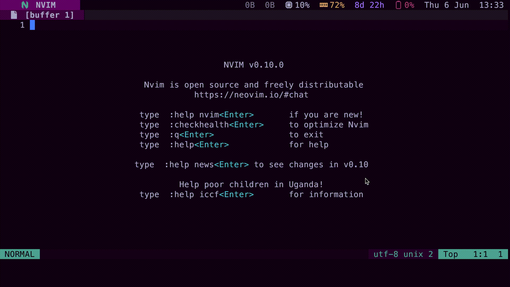

# Telescope HTML Tags

A Neovim plugin to view brief [MDN](https://developer.mozilla.org/) documentation for HTML tags using [Telescope](nvim-telescope/telescope.nvim).

Select a tag to open its full documentation in your browser.



## Install

For example, with [packer.nvim](https://github.com/wbthomason/packer.nvim):

```lua
use({
  'devkvlt/telescope-html-tags',
  requires = { 'nvim-telescope/telescope.nvim' },
})
```

## Setup

```lua
require('telescope-html-tags').setup()
```

This sets up the plugin with the following defaults:

```lua
config = {
  open_command = {
    ['Linux'] = 'xdg-open',
    ['OSX'] = 'open',
    ['Windows'] = 'start',
  },
}
```

## Command

Call with `:TelescopeFindHTMLTags`.

Or: `:lua require('telescope-html-tags').find_html_tags()`.
